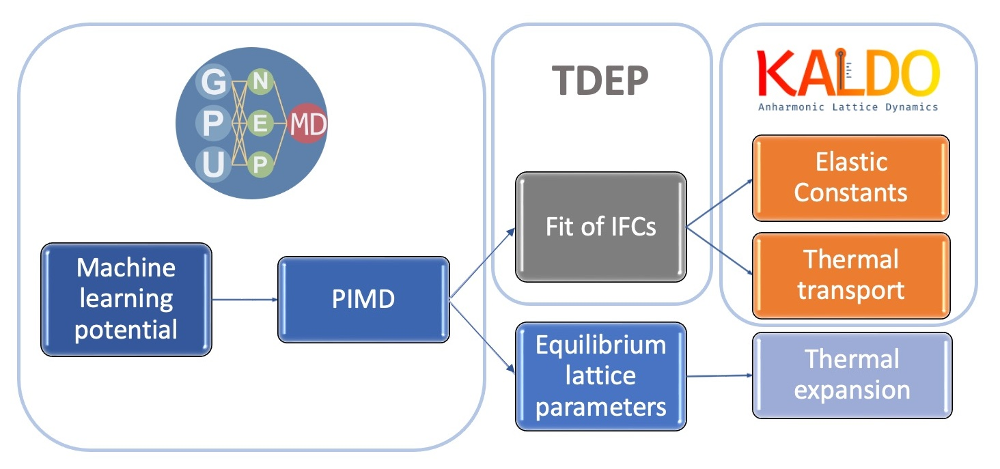

# PIMD + TDEP + kALDo for bulk silicon

SI of paper "Elastic moduli and thermal conductivity of quantum materials at finite temperature" .

   
This repository is structured as follow:

* PIMD: Input files to perform Path-Integral Molecular Dynamics (PIMD) simulations, using [GPUMD](https://github.com/brucefan1983/GPUMD).

* TDEP: Input files to extract force constants from temperature depedent effective potentials, using [TDEP](https://tdep-developers.github.io/tdep/).
  
* kALDo: Example to peform lattice dynamics and Boltzmann Transport Equation (BTE) using [kALDo](https://github.com/nanotheorygroup/kaldo).

* PIMD-traj:xyz files of the PIMD trajectory from GPUMD runs. 

* Suppmental-data: Experimental and simulated results to reproduce figures shown in the manuscript.
